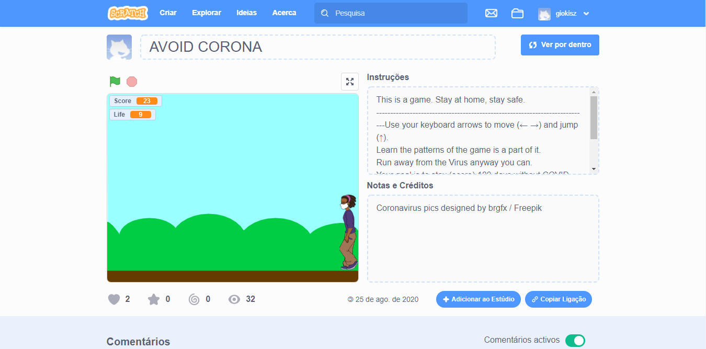

# CS50 - GIOVANI KISZ

This repository contains my codes from the 2020 CS50x course.
This is a way of sharing my learning and my projects.
  
## Progress

- [X] Week 0
  - [X] Scratch
- [ ] Week 1
  - [X] Mario
  - [X] Cash
  - [ ] Credit
- [ ] Week 2
- [ ] Week 3
- [ ] Week 4
- [ ] Week 5
- [ ] Week 6
- [ ] Week 7
- [ ] Week 8
- [ ] Final Project

  

## Problem Set 0

The firts CS50's problem was a Scratch Project, theme free, just to get used to programming logic.

My project was a game called **AVOID CORONA**, where you use your keyboard's arrows to move left and right, and jump, trying to avoid incomming virus.
You can find my full project on [Scratch Website](https://scratch.mit.edu/projects/418053427)

 

## Problem Set 1

Here I have 3 exercises using progamming language C with simple functions.

### [hello.c](2020/PSET1/hello.c)

Just like anyother programming language, with C we started by creating a _Hello, World!_ code.
But the intention of this execise was testing the `get_string` function, a function used on CS50 course.
The program ask the user's name and print the phrase `hello, [user_name]`.

### [mario.c](2020/PSET1/mario.c)

Using the famous game "Mario Bros" as an inspiration this program ask the user to enter a height and creat a pyramid of # using the height input.
  

> Image from [CS50x website](https://cs50.harvard.edu/x/2020/psets/1/mario/more/) 
 
### [cash.c](2020/PSET1/cash.c)

On this problem we were told to build a coda using greedy algorithm. According to the National Institute of Standards and Technology (NIST), a greedy algorithm is: 
> “one that always takes the best immediate, or local, solution while finding an answer. Greedy algorithms find the overall, or globally, optimal solution for some optimization problems, but may find less-than-optimal solutions for some instances of other problems.”

Summarizing, the code was supposed to take a value of change and return how many coins a cashier would have to give to a client, using 0.25 (quarters), 0.10 (dimes), 0.05 (nickels), 0.01 (pennies), for coins values.

### [credit.c](2020/PSET1/credit.c)

This was the hardest exercise within week 1. You should recive a (credit) card number and check if it was valid ou not. Afetar that, you should analyze if it was a American Express, Mastercard or Visa card. The problem here was to deal with so many possibilites: maybe it's okay, but according to the card number's lenght it should be American Express, but because it don't start with 34 or 37 it's invalid.

 

The math to check it is:

 

> Multiply every other digit by 2, starting with the number’s second-to-last digit, and then add those products’ digits together.
Add the sum to the sum of the digits that weren’t multiplied by 2.
If the total’s last digit is 0 (or, put more formally, if the total modulo 10 is congruent to 0), the number is valid!

 

Besides that, we have to follow some rules:
  - American Express
    1. Length: 15 digit numbers
    2. Starter number: 34 or 37
  - Mastercard
    1. Length: 16 digit numbers,
    2. Starter number: 51, 52, 53, 54, or 55
  - Visa
    1. Length: 13 or 16 digit numbers
    2. Starter number: 4
    
 
For more explanations [visit CS50x website.](https://cs50.harvard.edu/x/2020/psets/1/credit/)
